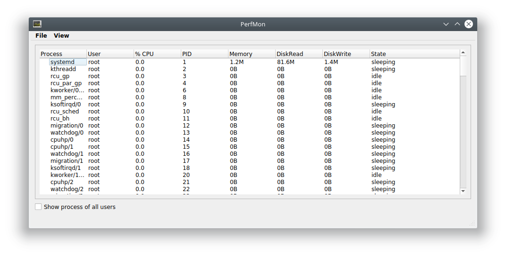
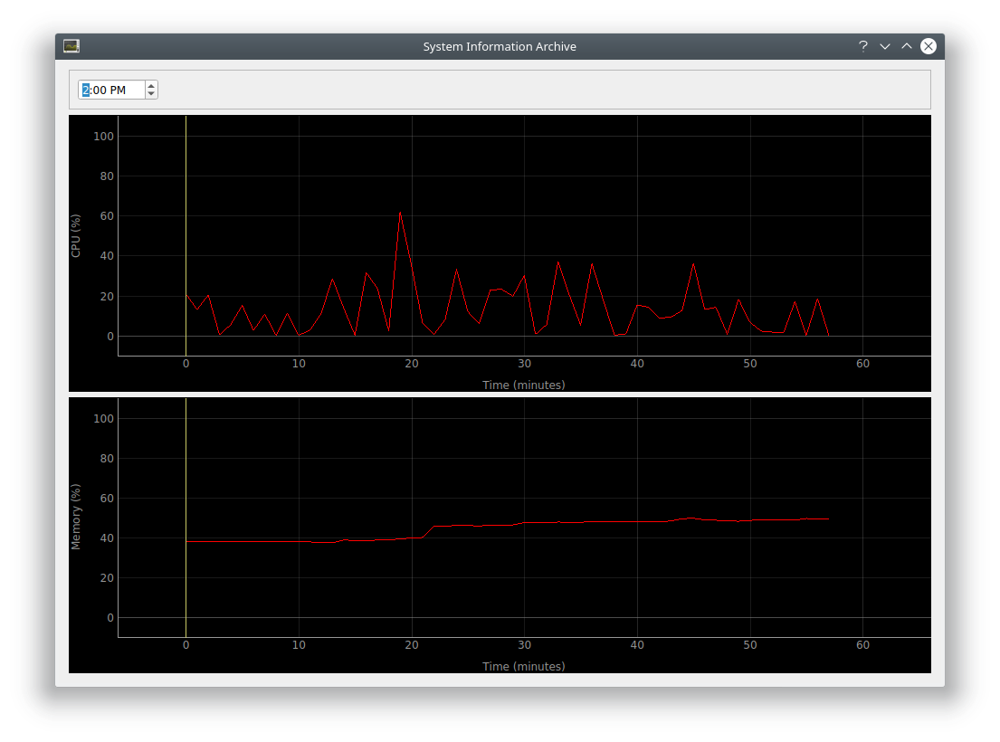

# PerfMon

**The last Performance Monitor you'll ever need!**

To run the performance monitor:

```
sudo python3 PerfMon.py
```

This brings up the main window:



You can rearrange and resize the columns by dragging them and their borders, respectively. By default, the window only displays processes started by root. You can have it show processes belonging to any user by clicking the checkbox labeled "Show processes of all users" located below the table:


You can see a graph depicting the system's current performance by selecting View > System Information from the menu bar, or by typing Alt-I:


You can click the button labled "Archives" to see a graph representing the history of the system's performance over the past 24 hours, as logged in the metrics collection database:



You can change the hour displayed using either the arrow keys or the arrow buttons on the right-hand side of the hour field above the graphs.

To quit PerfMon, click the close window button, select File > Exit, or click Alt-X while the main window is active. Note that any child window (System Information or System Information Archive) must be closed before its parent can be interacted with.
